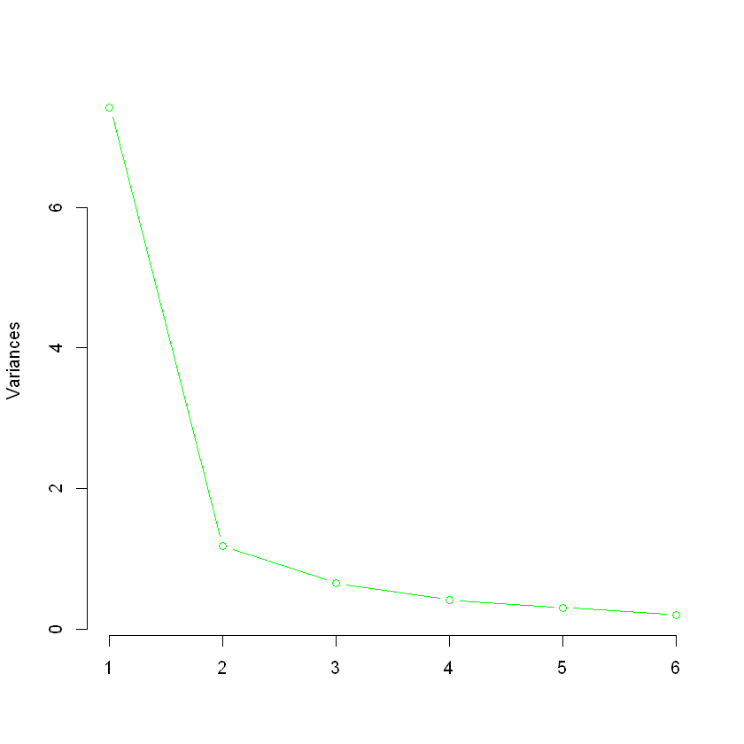

```R
train=read.csv("train.csv", header = T)
test=read.csv('test.csv',header=T)
```


```R
#library import
library(mice)
library(rms)
library(finalfit)
library(randomForest) # random forests
library(doParallel) # parallel missForest
library(visdat) # missingness plots
 # median/mode imputation
library(missForest)
library(dplyr)
library(caret)

```

    Warning message:
    "package 'mice' was built under R version 3.6.3"
    Attaching package: 'mice'
    
    The following objects are masked from 'package:base':
    
        cbind, rbind
    
    Warning message:
    "package 'rms' was built under R version 3.6.3"Loading required package: Hmisc
    Warning message:
    "package 'Hmisc' was built under R version 3.6.3"Loading required package: lattice
    Loading required package: survival
    Warning message:
    "package 'survival' was built under R version 3.6.3"Loading required package: Formula
    Warning message:
    "package 'Formula' was built under R version 3.6.3"Loading required package: ggplot2
    Warning message:
    "package 'ggplot2' was built under R version 3.6.3"
    Attaching package: 'Hmisc'
    
    The following objects are masked from 'package:base':
    
        format.pval, units
    
    Loading required package: SparseM
    Warning message:
    "package 'SparseM' was built under R version 3.6.2"
    Attaching package: 'SparseM'
    
    The following object is masked from 'package:base':
    
        backsolve
    
    Warning message:
    "package 'finalfit' was built under R version 3.6.3"Warning message:
    "package 'randomForest' was built under R version 3.6.3"randomForest 4.6-14
    Type rfNews() to see new features/changes/bug fixes.
    
    Attaching package: 'randomForest'
    
    The following object is masked from 'package:ggplot2':
    
        margin
    
    Warning message:
    "package 'doParallel' was built under R version 3.6.3"Loading required package: foreach
    Warning message:
    "package 'foreach' was built under R version 3.6.3"Loading required package: iterators
    Warning message:
    "package 'iterators' was built under R version 3.6.3"Loading required package: parallel
    Warning message:
    "package 'visdat' was built under R version 3.6.3"Warning message:
    "package 'missForest' was built under R version 3.6.3"Loading required package: itertools
    Warning message:
    "package 'itertools' was built under R version 3.6.3"Warning message:
    "package 'dplyr' was built under R version 3.6.3"
    Attaching package: 'dplyr'
    
    The following object is masked from 'package:randomForest':
    
        combine
    
    The following objects are masked from 'package:Hmisc':
    
        src, summarize
    
    The following objects are masked from 'package:stats':
    
        filter, lag
    
    The following objects are masked from 'package:base':
    
        intersect, setdiff, setequal, union
    
    

# 1. EDA
   - Y값이 balanced 되어있는지 확인하여 오버샘플링이 필요한지 체크
   - X변수들의 분포 확인하여 범주형 자료의 경우 범주에 벗어난 데이터나 연속형 자료의 경우 양수여야 하는데 음수인 데이터 등은 NA로 처리해주었다.
   - correlation plot
   


```R
all=rbind(train,test)
```


```R
ggplot(all,aes(Y),)+geom_bar(fill='blue')
# balanced data set이라 ROS나 RUS는 따로 필요 없다고 판단 된다.
```


```R
ggplot(all,aes(X2),)+geom_bar(fill='blue')
```

    Warning message:
    "Removed 17 rows containing non-finite values (stat_count)."


```R
ggplot(all,aes(X1),)+geom_bar(fill='blue')
```


```R
ggplot(train,aes(X3),)+geom_bar(fill='blue')
```

    Warning message:
    "Removed 17 rows containing non-finite values (stat_count)."


```R
#X3는 교육 수준인데 그니까 1~4만 있는데 5랑 6도 보임=>이상치로 간주하고 NA로 채워주기

train$X3=ifelse(train$X3 == 5,NA,train$X3)
train$X3=ifelse(train$X3 == 6,NA,train$X3)

```


```R
#after pre-processing X3
ggplot(train,aes(X3),)+geom_bar(fill='blue')

```

    Warning message:
    "Removed 31 rows containing non-finite values (stat_count)."


```R
ggplot(train,aes(X4),)+geom_bar(fill='blue')

```

    Warning message:
    "Removed 16 rows containing non-finite values (stat_count)."


```R
train$X4=ifelse(train$X4 == 0,NA,train$X4)
#마찬가지로 NA로 바꿔주기

```


```R
#X3 전처리 후 1~3만 남게 됨.
ggplot(train,aes(X4),)+geom_bar(fill='blue')
```

    Warning message:
    "Removed 21 rows containing non-finite values (stat_count)."


```R
ggplot(train,aes(X5),)+geom_bar(fill='blue')
#다 정상 범주인 듯

```

    Warning message:
    "Removed 23 rows containing non-finite values (stat_count)."


```R
ggplot(train,aes(X11),)+geom_bar(fill='blue')
#X6~X11은 -2~9의 값을 가진다.
#X11이 연체 및 조기납부가 많아보인다

```

    Warning message:
    "Removed 16 rows containing non-finite values (stat_count)."


```R
ggplot(train,aes(X12),)+geom_density(fill='blue')
#amout of bill인데 음수값이 보임
```

    Warning message:
    "Removed 20 rows containing non-finite values (stat_density)."


```R
#움수값 제거
train$X12=ifelse(train$X12 <0,NA,train$X12)
train$X13=ifelse(train$X13 <0,NA,train$X13)
train$X14=ifelse(train$X14 <0,NA,train$X14)
train$X15=ifelse(train$X15 <0,NA,train$X15)
train$X16=ifelse(train$X16 <0,NA,train$X16)
train$X17=ifelse(train$X17 <0,NA,train$X17)
```


```R
ggplot(train,aes(X12),)+geom_density(fill='blue')
#음수값 NA로 처리 후의 plot(X12~X17 모두 0 이상을 갖게됨)
```

    Warning message:
    "Removed 60 rows containing non-finite values (stat_density)."


```R
ggplot(train,aes(X18),)+geom_density(fill='blue')

```

    Warning message:
    "Removed 23 rows containing non-finite values (stat_density)."


## correlation plot
   - X6~X11까지 강한 양의 선형관계
   - 왜인지 모르게 X12와 X13(즉, 4월의 청구금액과 5월의 청구금액 그리고 11월 청구금액이 0.96으로 강한 선형관계 나타냄
   - Y와 가장 높은 상관관계 보인 것은 X1(given credit)과 X11(11월 납부 기록)이었다.
    
    


```R
library(corrplot)
numericVars <- which(sapply(train, is.numeric))
numericVarNames <- names(numericVars)
all_numVar <- train[, numericVars]
cor_numVar <- cor(all_numVar, use="pairwise.complete.obs")
cor_sorted <- as.matrix(sort(cor_numVar[,'Y'], decreasing = TRUE))
CorHigh <- names(which(apply(cor_sorted, 1, function(x) abs(x)>0.01)))
cor_numVar <- cor_numVar[CorHigh, CorHigh]
corrplot.mixed(cor_numVar, tl.col="black", tl.pos = "lt")
```

    Warning message:
    "package 'corrplot' was built under R version 3.6.3"corrplot 0.84 loaded
    


# 2. data-preprocessing


```R
table(is.na(train))
table(is.na(test))
```


    
    FALSE  TRUE 
    47348   652 


    
    FALSE 
    72000 


```R
head(train)
```


<table>
<thead><tr><th scope=col>X1</th><th scope=col>X2</th><th scope=col>X3</th><th scope=col>X4</th><th scope=col>X5</th><th scope=col>X6</th><th scope=col>X7</th><th scope=col>X8</th><th scope=col>X9</th><th scope=col>X10</th><th scope=col>...</th><th scope=col>X15</th><th scope=col>X16</th><th scope=col>X17</th><th scope=col>X18</th><th scope=col>X19</th><th scope=col>X20</th><th scope=col>X21</th><th scope=col>X22</th><th scope=col>X23</th><th scope=col>Y</th></tr></thead>
<tbody>
	<tr><td>210000</td><td>1     </td><td>3     </td><td>1     </td><td>41    </td><td>-1    </td><td> 0    </td><td> 0    </td><td> 2    </td><td>-1    </td><td>...   </td><td>  1170</td><td>  1732</td><td>   390</td><td> 3750 </td><td>69438 </td><td>    0 </td><td>    0 </td><td>    0 </td><td>1732  </td><td>1     </td></tr>
	<tr><td>150000</td><td>2     </td><td>1     </td><td>2     </td><td>25    </td><td> 2    </td><td> 2    </td><td> 2    </td><td> 2    </td><td> 3    </td><td>...   </td><td>146844</td><td>148157</td><td>147260</td><td> 5500 </td><td> 5300 </td><td> 5300 </td><td> 5300 </td><td> 5202 </td><td>8100  </td><td>1     </td></tr>
	<tr><td>350000</td><td>1     </td><td>2     </td><td>1     </td><td>37    </td><td> 0    </td><td> 0    </td><td> 0    </td><td> 0    </td><td> 0    </td><td>...   </td><td>224591</td><td>221056</td><td>219376</td><td>20000 </td><td>29459 </td><td> 9247 </td><td>35300 </td><td> 7957 </td><td>7669  </td><td>0     </td></tr>
	<tr><td>240000</td><td>1     </td><td>3     </td><td>2     </td><td>41    </td><td> 0    </td><td> 0    </td><td> 0    </td><td> 0    </td><td> 0    </td><td>...   </td><td>187258</td><td>205981</td><td>218435</td><td> 4236 </td><td> 4903 </td><td> 4179 </td><td> 5268 </td><td>17020 </td><td>5778  </td><td>0     </td></tr>
	<tr><td>390000</td><td>2     </td><td>2     </td><td>1     </td><td>41    </td><td> 0    </td><td> 0    </td><td> 0    </td><td> 0    </td><td> 0    </td><td>...   </td><td>212726</td><td>214504</td><td>216622</td><td> 7000 </td><td> 7214 </td><td> 7103 </td><td> 7228 </td><td> 7500 </td><td>7244  </td><td>0     </td></tr>
	<tr><td>500000</td><td>2     </td><td>1     </td><td>1     </td><td>37    </td><td>-2    </td><td>-2    </td><td>-2    </td><td>-2    </td><td>-2    </td><td>...   </td><td> 12171</td><td>  9505</td><td>  6757</td><td> 8602 </td><td>67206 </td><td>29321 </td><td>11564 </td><td>12176 </td><td>9505  </td><td>0     </td></tr>
</tbody>
</table>


## 2-1. data imputation
- X1 제외 컬럼에 모두 결측치 존재하는 상황
- 10개~20개 정도로 그렇게 결측치 비중이 높지 않은 편
- 범주형과 연속형 모두 missing이 일어나고 있음
- 로버스트하며 가정이 따로 필요 없으며 비모수적 방법이고, 고차원 데이터에 적합한 MissForest 사용


# MissForest algorithm

1. 결측이 있는 행을 일단 평균이나 미디안으로 rough하게 채워놓음
2. 결측의 정도에 따라(퍼센티지) 오름차순 정렬(즉, 결측이 적은 열이 앞으로 온다)
3. 결측이 가장 적은 행에 대하여(예를 들어 X1이 결측이 제일 적었고, 3,15번째 행이 결측이었다 가정하면)
    - 3, 15번째 관측치를 제외하고 X1에 대하여 RF모델 FIT
    - 3, 15번째 관측치에 대해 FIT된 모델을 이용하여 predict
    - 이렇게 보간된 matrix를 업데이트
4. 그 다음 결측이 적은 행이 X3라고 가정하고, 결측치가 6,7,15였다고 생각하면
    - 6,7,15번째 값을 제외하고 제외하고 X3에 대해 RF FIT
    - FIT된 모델로 저 세개 값 predict 해서 imputed matrix update


```R
#misiing visulization
vis_miss(train,show_perc = F) + coord_flip()
```


```R
# 무슨 행에 결측치가 있는지
train$X2=factor(as.character(train$X2))#gender
train$X3=factor(as.character(train$X3))#education
train$X4=factor(as.character(train$X4))#marry
train$Y=factor(as.character(train$Y))

```


```R
test$X2=factor(as.character(test$X2))#gender
test$X3=factor(as.character(test$X3))#education
test$X4=factor(as.character(test$X4))#marry
test$Y=factor(as.character(test$Y))
```


```R
test$X2=as.factor(test$X2)#gender

test$X3=as.factor(test$X3)#education
test$X4=as.factor(test$X4)#marry

test$Y=as.factor(test$Y)

```


```R
set.seed(785)
imp_train=missForest(train)$ximp
```

      missForest iteration 1 in progress...done!
      missForest iteration 2 in progress...done!
      missForest iteration 3 in progress...done!
      missForest iteration 4 in progress...done!
    


```R
imp_train_copy=imp_train
```


```R
vis_miss(imp_train,show_perc = F) + coord_flip()
```


# Feature Enginnering
- Kernel PCA를 사용하여 상관관계가 높은 X6~X11변수를 2차원으로 축소한 변수 추가


```R
#install.packages('mdatools')
library(mdatools)
```

    Warning message:
    "package 'mdatools' was built under R version 3.6.3"
    Attaching package: 'mdatools'
    
    The following object is masked from 'package:Hmisc':
    
        capitalize
    
    


```R
pc=prcomp(imp_train[,6:11])
```


```R
summary(pc)
```


    Importance of components:
                              PC1    PC2     PC3     PC4     PC5     PC6
    Standard deviation     2.7242 1.0861 0.81142 0.64246 0.55612 0.44735
    Proportion of Variance 0.7289 0.1159 0.06467 0.04054 0.03038 0.01965
    Cumulative Proportion  0.7289 0.8448 0.90943 0.94997 0.98035 1.00000


```R
screeplot(pc, main = "", col = "green", type = "lines", pch = 1, npcs = length(pc$sdev))
```





```R
all2=rbind(imp_train,test)

```


```R
#install.packages('kernlab') 
#sigma=4 일때 최적의 성능 (rf 기준)
library(kernlab) 
fit = kpca(~., data=all2[,6:11], kernel='rbfdot', kpar=list(sigma=4), features=2) 


pc = pcv(fit)

all2$PC1=pc[,1]
all2$PC2=pc[,2]

```

    
    Attaching package: 'kernlab'
    
    The following object is masked from 'package:ggplot2':
    
        alpha
    
    


```R
imp_train=all2[1:2000,]
test=all2[2001:4000,]
```


```R
imp_train=imp_train[,-2]
test=test[-2]
```

# modeling
 - 후보 모델: xgboost, naive bayes, SVC, rf, glm
     - xgb등의 boosting 계열 모델은 데이터 수 때문인지 성능이 별로
     - glm 또한 성능 별로
     - SVC, RF, NB가 높은 성능 보였음
     - 따라서 이 세가지 독립적인(즉, 모델간의 유사성이 크지 않은) 모델의 멱평균 앙상블을 통한 soft voting으로 최종 예측 결과 도출
     - 정확도( 1-missclassifcation rate) 약 80까지 달성
     

# modeling- random forest


```R
#grid_search for hyper parameter mtry

seed=10
metric='Accuracy'
set.seed(seed)


ctrl=trainControl(method='boot',search = 'random')
rf_random=train(Y~.,data=imp_train,method='rf',metric = metric,tuneLength = 15)
trControl=ctrl
print(rf_random)
```

    Random Forest 
    
    2000 samples
      24 predictor
       2 classes: '0', '1' 
    
    No pre-processing
    Resampling: Bootstrapped (25 reps) 
    Summary of sample sizes: 2000, 2000, 2000, 2000, 2000, 2000, ... 
    Resampling results across tuning parameters:
    
      mtry  Accuracy   Kappa    
       2    0.6973310  0.3951281
       4    0.6877571  0.3759052
       6    0.6886047  0.3776165
       8    0.6853508  0.3710857
      10    0.6853602  0.3711269
      12    0.6842062  0.3687898
      14    0.6839008  0.3681560
      16    0.6803133  0.3611013
      18    0.6814794  0.3632864
      20    0.6805813  0.3614991
      22    0.6784925  0.3573191
      24    0.6779129  0.3561903
      26    0.6774628  0.3552863
      28    0.6768607  0.3541458
      30    0.6760346  0.3524767
    
    Accuracy was used to select the optimal model using the largest value.
    The final value used for the model was mtry = 2.
    


```R
plot(rf_random)
```


```R
set.seed(2)#시드따라 많이 달라져서 시드 바꿔가서 평균 내기
train1=imp_train
X_train=select(train1,-Y)
y_train=select(train1,select=Y)

X_test=select(test,-Y)
y_test=select(test,Y)
rf=randomForest(Y~.,data=imp_train,mtry = 2)
test_pred=predict(rf,X_test,type='class')
library('e1071')
library(caret)
test_pred=as.factor(test_pred)
y_test=as.factor(data.frame(y_test)[,'Y'])
 
confusionMatrix(test_pred,y_test)
```

    Warning message:
    "package 'e1071' was built under R version 3.6.3"
    Attaching package: 'e1071'
    
    The following object is masked from 'package:Hmisc':
    
        impute
    
    


    Confusion Matrix and Statistics
    
              Reference
    Prediction    0    1
             0 1138  176
             1  352  334
                                              
                   Accuracy : 0.736           
                     95% CI : (0.7161, 0.7552)
        No Information Rate : 0.745           
        P-Value [Acc > NIR] : 0.8288          
                                              
                      Kappa : 0.376           
                                              
     Mcnemar's Test P-Value : 2.619e-14       
                                              
                Sensitivity : 0.7638          
                Specificity : 0.6549          
             Pos Pred Value : 0.8661          
             Neg Pred Value : 0.4869          
                 Prevalence : 0.7450          
             Detection Rate : 0.5690          
       Detection Prevalence : 0.6570          
          Balanced Accuracy : 0.7093          
                                              
           'Positive' Class : 0               
                                              


```R
rf_pred=predict(rf,X_test,type='prob')#for soft voting
```

# modeling-xgboost
 - 이 부분은 최종 예측에는 사용하지 않음


```R
# set.seed(787)
# library(xgboost)
# 
# labels <- imp_train$Y
# ts_label <- test$Y
# new_tr <- model.matrix(~.+0,data = select(imp_train,-Y)) 
# new_ts <- model.matrix(~.+0,data = select(test,-Y)) 
# labels <- as.numeric(labels)-1
# ts_label <- as.numeric(ts_label)-1
# 
# dtrain <- xgb.DMatrix(data = new_tr,label = labels) 
# dtest <- xgb.DMatrix(data = new_ts,label=ts_label)
# set.seed(0)
# params <- list(booster = "gbtree", objective = "binary:logistic", eta=0.05 , gamma=0.45, max_depth=20, min_child_weight=1, subsample=0.9, colsample_bytree=1)
# 
# xgbcv <- xgb.cv( params = params, data = dtrain, nrounds = 100, nfold = 5,  early_stopping_rounds = 20, )
#best iter at 11
# 
# min(xgbcv$evaluation_log$test_error_mean)
#0.30

# xgb1 <- xgb.train (params = params, data = dtrain, nrounds = 200, watchlist = list(val=dtest,train=dtrain), early_stopping_rounds = 30, , eval_metric = "error")
# 
# xgbpred <- predict (xgb1,dtest)
# xgbpred <- ifelse (xgbpred > 0.5,1,0)
# 
# xgbpred=as.factor(xgbpred)
# 
# ts_label=as.factor(ts_label)
# 
# confusionMatrix (xgbpred, ts_label)
# 

```

# modeling-SVC
- scale에 민감한 SVC의 특성을 고려하여 scaling 진행 


```R
#install.packages('kernlab')

library("kernlab")

```


```R
#grid search for sigma, C
ctrl=trainControl(method='boot',search = 'random')
svm_random=train(Y~.,data=imp_train,method='svmRadial',metric = metric,tuneLength = 15)
trControl=ctrl

```

    Warning message in .local(x, ...):
    "Variable(s) `' constant. Cannot scale data."Warning message in .local(x, ...):
    "Variable(s) `' constant. Cannot scale data."Warning message in .local(x, ...):
    "Variable(s) `' constant. Cannot scale data."Warning message in .local(x, ...):
    "Variable(s) `' constant. Cannot scale data."Warning message in .local(x, ...):
    "Variable(s) `' constant. Cannot scale data."Warning message in .local(x, ...):
    "Variable(s) `' constant. Cannot scale data."Warning message in .local(x, ...):
    "Variable(s) `' constant. Cannot scale data."Warning message in .local(x, ...):
    "Variable(s) `' constant. Cannot scale data."Warning message in .local(x, ...):
    "Variable(s) `' constant. Cannot scale data."Warning message in .local(x, ...):
    "Variable(s) `' constant. Cannot scale data."Warning message in .local(x, ...):
    "Variable(s) `' constant. Cannot scale data."Warning message in .local(x, ...):
    "Variable(s) `' constant. Cannot scale data."Warning message in .local(x, ...):
    "Variable(s) `' constant. Cannot scale data."Warning message in .local(x, ...):
    "Variable(s) `' constant. Cannot scale data."Warning message in .local(x, ...):
    "Variable(s) `' constant. Cannot scale data."Warning message in .local(x, ...):
    "Variable(s) `' constant. Cannot scale data."Warning message in .local(x, ...):
    "Variable(s) `' constant. Cannot scale data."Warning message in .local(x, ...):
    "Variable(s) `' constant. Cannot scale data."Warning message in .local(x, ...):
    "Variable(s) `' constant. Cannot scale data."Warning message in .local(x, ...):
    "Variable(s) `' constant. Cannot scale data."Warning message in .local(x, ...):
    "Variable(s) `' constant. Cannot scale data."Warning message in .local(x, ...):
    "Variable(s) `' constant. Cannot scale data."Warning message in .local(x, ...):
    "Variable(s) `' constant. Cannot scale data."Warning message in .local(x, ...):
    "Variable(s) `' constant. Cannot scale data."Warning message in .local(x, ...):
    "Variable(s) `' constant. Cannot scale data."Warning message in .local(x, ...):
    "Variable(s) `' constant. Cannot scale data."Warning message in .local(x, ...):
    "Variable(s) `' constant. Cannot scale data."Warning message in .local(x, ...):
    "Variable(s) `' constant. Cannot scale data."Warning message in .local(x, ...):
    "Variable(s) `' constant. Cannot scale data."Warning message in .local(x, ...):
    "Variable(s) `' constant. Cannot scale data."Warning message in .local(x, ...):
    "Variable(s) `' constant. Cannot scale data."Warning message in .local(x, ...):
    "Variable(s) `' constant. Cannot scale data."Warning message in .local(x, ...):
    "Variable(s) `' constant. Cannot scale data."Warning message in .local(x, ...):
    "Variable(s) `' constant. Cannot scale data."Warning message in .local(x, ...):
    "Variable(s) `' constant. Cannot scale data."Warning message in .local(x, ...):
    "Variable(s) `' constant. Cannot scale data."Warning message in .local(x, ...):
    "Variable(s) `' constant. Cannot scale data."Warning message in .local(x, ...):
    "Variable(s) `' constant. Cannot scale data."Warning message in .local(x, ...):
    "Variable(s) `' constant. Cannot scale data."Warning message in .local(x, ...):
    "Variable(s) `' constant. Cannot scale data."Warning message in .local(x, ...):
    "Variable(s) `' constant. Cannot scale data."Warning message in .local(x, ...):
    "Variable(s) `' constant. Cannot scale data."Warning message in .local(x, ...):
    "Variable(s) `' constant. Cannot scale data."Warning message in .local(x, ...):
    "Variable(s) `' constant. Cannot scale data."Warning message in .local(x, ...):
    "Variable(s) `' constant. Cannot scale data."Warning message in .local(x, ...):
    "Variable(s) `' constant. Cannot scale data."Warning message in .local(x, ...):
    "Variable(s) `' constant. Cannot scale data."Warning message in .local(x, ...):
    "Variable(s) `' constant. Cannot scale data."Warning message in .local(x, ...):
    "Variable(s) `' constant. Cannot scale data."Warning message in .local(x, ...):
    "Variable(s) `' constant. Cannot scale data."Warning message in .local(x, ...):
    "Variable(s) `' constant. Cannot scale data."Warning message in .local(x, ...):
    "Variable(s) `' constant. Cannot scale data."Warning message in .local(x, ...):
    "Variable(s) `' constant. Cannot scale data."Warning message in .local(x, ...):
    "Variable(s) `' constant. Cannot scale data."Warning message in .local(x, ...):
    "Variable(s) `' constant. Cannot scale data."Warning message in .local(x, ...):
    "Variable(s) `' constant. Cannot scale data."Warning message in .local(x, ...):
    "Variable(s) `' constant. Cannot scale data."Warning message in .local(x, ...):
    "Variable(s) `' constant. Cannot scale data."Warning message in .local(x, ...):
    "Variable(s) `' constant. Cannot scale data."Warning message in .local(x, ...):
    "Variable(s) `' constant. Cannot scale data."Warning message in .local(x, ...):
    "Variable(s) `' constant. Cannot scale data."Warning message in .local(x, ...):
    "Variable(s) `' constant. Cannot scale data."Warning message in .local(x, ...):
    "Variable(s) `' constant. Cannot scale data."Warning message in .local(x, ...):
    "Variable(s) `' constant. Cannot scale data."Warning message in .local(x, ...):
    "Variable(s) `' constant. Cannot scale data."Warning message in .local(x, ...):
    "Variable(s) `' constant. Cannot scale data."Warning message in .local(x, ...):
    "Variable(s) `' constant. Cannot scale data."Warning message in .local(x, ...):
    "Variable(s) `' constant. Cannot scale data."Warning message in .local(x, ...):
    "Variable(s) `' constant. Cannot scale data."Warning message in .local(x, ...):
    "Variable(s) `' constant. Cannot scale data."Warning message in .local(x, ...):
    "Variable(s) `' constant. Cannot scale data."Warning message in .local(x, ...):
    "Variable(s) `' constant. Cannot scale data."Warning message in .local(x, ...):
    "Variable(s) `' constant. Cannot scale data."Warning message in .local(x, ...):
    "Variable(s) `' constant. Cannot scale data."Warning message in .local(x, ...):
    "Variable(s) `' constant. Cannot scale data."Warning message in .local(x, ...):
    "Variable(s) `' constant. Cannot scale data."Warning message in .local(x, ...):
    "Variable(s) `' constant. Cannot scale data."Warning message in .local(x, ...):
    "Variable(s) `' constant. Cannot scale data."Warning message in .local(x, ...):
    "Variable(s) `' constant. Cannot scale data."Warning message in .local(x, ...):
    "Variable(s) `' constant. Cannot scale data."Warning message in .local(x, ...):
    "Variable(s) `' constant. Cannot scale data."Warning message in .local(x, ...):
    "Variable(s) `' constant. Cannot scale data."Warning message in .local(x, ...):
    "Variable(s) `' constant. Cannot scale data."Warning message in .local(x, ...):
    "Variable(s) `' constant. Cannot scale data."Warning message in .local(x, ...):
    "Variable(s) `' constant. Cannot scale data."Warning message in .local(x, ...):
    "Variable(s) `' constant. Cannot scale data."Warning message in .local(x, ...):
    "Variable(s) `' constant. Cannot scale data."Warning message in .local(x, ...):
    "Variable(s) `' constant. Cannot scale data."Warning message in .local(x, ...):
    "Variable(s) `' constant. Cannot scale data."Warning message in .local(x, ...):
    "Variable(s) `' constant. Cannot scale data."Warning message in .local(x, ...):
    "Variable(s) `' constant. Cannot scale data."Warning message in .local(x, ...):
    "Variable(s) `' constant. Cannot scale data."Warning message in .local(x, ...):
    "Variable(s) `' constant. Cannot scale data."Warning message in .local(x, ...):
    "Variable(s) `' constant. Cannot scale data."Warning message in .local(x, ...):
    "Variable(s) `' constant. Cannot scale data."Warning message in .local(x, ...):
    "Variable(s) `' constant. Cannot scale data."Warning message in .local(x, ...):
    "Variable(s) `' constant. Cannot scale data."Warning message in .local(x, ...):
    "Variable(s) `' constant. Cannot scale data."Warning message in .local(x, ...):
    "Variable(s) `' constant. Cannot scale data."Warning message in .local(x, ...):
    "Variable(s) `' constant. Cannot scale data."Warning message in .local(x, ...):
    "Variable(s) `' constant. Cannot scale data."Warning message in .local(x, ...):
    "Variable(s) `' constant. Cannot scale data."Warning message in .local(x, ...):
    "Variable(s) `' constant. Cannot scale data."Warning message in .local(x, ...):
    "Variable(s) `' constant. Cannot scale data."Warning message in .local(x, ...):
    "Variable(s) `' constant. Cannot scale data."Warning message in .local(x, ...):
    "Variable(s) `' constant. Cannot scale data."Warning message in .local(x, ...):
    "Variable(s) `' constant. Cannot scale data."Warning message in .local(x, ...):
    "Variable(s) `' constant. Cannot scale data."Warning message in .local(x, ...):
    "Variable(s) `' constant. Cannot scale data."Warning message in .local(x, ...):
    "Variable(s) `' constant. Cannot scale data."Warning message in .local(x, ...):
    "Variable(s) `' constant. Cannot scale data."Warning message in .local(x, ...):
    "Variable(s) `' constant. Cannot scale data."Warning message in .local(x, ...):
    "Variable(s) `' constant. Cannot scale data."Warning message in .local(x, ...):
    "Variable(s) `' constant. Cannot scale data."Warning message in .local(x, ...):
    "Variable(s) `' constant. Cannot scale data."Warning message in .local(x, ...):
    "Variable(s) `' constant. Cannot scale data."Warning message in .local(x, ...):
    "Variable(s) `' constant. Cannot scale data."Warning message in .local(x, ...):
    "Variable(s) `' constant. Cannot scale data."Warning message in .local(x, ...):
    "Variable(s) `' constant. Cannot scale data."Warning message in .local(x, ...):
    "Variable(s) `' constant. Cannot scale data."Warning message in .local(x, ...):
    "Variable(s) `' constant. Cannot scale data."Warning message in .local(x, ...):
    "Variable(s) `' constant. Cannot scale data."Warning message in .local(x, ...):
    "Variable(s) `' constant. Cannot scale data."Warning message in .local(x, ...):
    "Variable(s) `' constant. Cannot scale data."Warning message in .local(x, ...):
    "Variable(s) `' constant. Cannot scale data."Warning message in .local(x, ...):
    "Variable(s) `' constant. Cannot scale data."Warning message in .local(x, ...):
    "Variable(s) `' constant. Cannot scale data."Warning message in .local(x, ...):
    "Variable(s) `' constant. Cannot scale data."Warning message in .local(x, ...):
    "Variable(s) `' constant. Cannot scale data."Warning message in .local(x, ...):
    "Variable(s) `' constant. Cannot scale data."Warning message in .local(x, ...):
    "Variable(s) `' constant. Cannot scale data."Warning message in .local(x, ...):
    "Variable(s) `' constant. Cannot scale data."Warning message in .local(x, ...):
    "Variable(s) `' constant. Cannot scale data."Warning message in .local(x, ...):
    "Variable(s) `' constant. Cannot scale data."Warning message in .local(x, ...):
    "Variable(s) `' constant. Cannot scale data."Warning message in .local(x, ...):
    "Variable(s) `' constant. Cannot scale data."Warning message in .local(x, ...):
    "Variable(s) `' constant. Cannot scale data."Warning message in .local(x, ...):
    "Variable(s) `' constant. Cannot scale data."Warning message in .local(x, ...):
    "Variable(s) `' constant. Cannot scale data."Warning message in .local(x, ...):
    "Variable(s) `' constant. Cannot scale data."Warning message in .local(x, ...):
    "Variable(s) `' constant. Cannot scale data."Warning message in .local(x, ...):
    "Variable(s) `' constant. Cannot scale data."Warning message in .local(x, ...):
    "Variable(s) `' constant. Cannot scale data."Warning message in .local(x, ...):
    "Variable(s) `' constant. Cannot scale data."Warning message in .local(x, ...):
    "Variable(s) `' constant. Cannot scale data."Warning message in .local(x, ...):
    "Variable(s) `' constant. Cannot scale data."Warning message in .local(x, ...):
    "Variable(s) `' constant. Cannot scale data."Warning message in .local(x, ...):
    "Variable(s) `' constant. Cannot scale data."Warning message in .local(x, ...):
    "Variable(s) `' constant. Cannot scale data."Warning message in .local(x, ...):
    "Variable(s) `' constant. Cannot scale data."Warning message in .local(x, ...):
    "Variable(s) `' constant. Cannot scale data."Warning message in .local(x, ...):
    "Variable(s) `' constant. Cannot scale data."Warning message in .local(x, ...):
    "Variable(s) `' constant. Cannot scale data."Warning message in .local(x, ...):
    "Variable(s) `' constant. Cannot scale data."Warning message in .local(x, ...):
    "Variable(s) `' constant. Cannot scale data."Warning message in .local(x, ...):
    "Variable(s) `' constant. Cannot scale data."Warning message in .local(x, ...):
    "Variable(s) `' constant. Cannot scale data."Warning message in .local(x, ...):
    "Variable(s) `' constant. Cannot scale data."Warning message in .local(x, ...):
    "Variable(s) `' constant. Cannot scale data."Warning message in .local(x, ...):
    "Variable(s) `' constant. Cannot scale data."Warning message in .local(x, ...):
    "Variable(s) `' constant. Cannot scale data."Warning message in .local(x, ...):
    "Variable(s) `' constant. Cannot scale data."Warning message in .local(x, ...):
    "Variable(s) `' constant. Cannot scale data."Warning message in .local(x, ...):
    "Variable(s) `' constant. Cannot scale data."Warning message in .local(x, ...):
    "Variable(s) `' constant. Cannot scale data."Warning message in .local(x, ...):
    "Variable(s) `' constant. Cannot scale data."Warning message in .local(x, ...):
    "Variable(s) `' constant. Cannot scale data."Warning message in .local(x, ...):
    "Variable(s) `' constant. Cannot scale data."Warning message in .local(x, ...):
    "Variable(s) `' constant. Cannot scale data."Warning message in .local(x, ...):
    "Variable(s) `' constant. Cannot scale data."Warning message in .local(x, ...):
    "Variable(s) `' constant. Cannot scale data."Warning message in .local(x, ...):
    "Variable(s) `' constant. Cannot scale data."Warning message in .local(x, ...):
    "Variable(s) `' constant. Cannot scale data."Warning message in .local(x, ...):
    "Variable(s) `' constant. Cannot scale data."Warning message in .local(x, ...):
    "Variable(s) `' constant. Cannot scale data."Warning message in .local(x, ...):
    "Variable(s) `' constant. Cannot scale data."Warning message in .local(x, ...):
    "Variable(s) `' constant. Cannot scale data."Warning message in .local(x, ...):
    "Variable(s) `' constant. Cannot scale data."Warning message in .local(x, ...):
    "Variable(s) `' constant. Cannot scale data."Warning message in .local(x, ...):
    "Variable(s) `' constant. Cannot scale data."Warning message in .local(x, ...):
    "Variable(s) `' constant. Cannot scale data."Warning message in .local(x, ...):
    "Variable(s) `' constant. Cannot scale data."Warning message in .local(x, ...):
    "Variable(s) `' constant. Cannot scale data."Warning message in .local(x, ...):
    "Variable(s) `' constant. Cannot scale data."Warning message in .local(x, ...):
    "Variable(s) `' constant. Cannot scale data."Warning message in .local(x, ...):
    "Variable(s) `' constant. Cannot scale data."Warning message in .local(x, ...):
    "Variable(s) `' constant. Cannot scale data."Warning message in .local(x, ...):
    "Variable(s) `' constant. Cannot scale data."Warning message in .local(x, ...):
    "Variable(s) `' constant. Cannot scale data."Warning message in .local(x, ...):
    "Variable(s) `' constant. Cannot scale data."Warning message in .local(x, ...):
    "Variable(s) `' constant. Cannot scale data."Warning message in .local(x, ...):
    "Variable(s) `' constant. Cannot scale data."Warning message in .local(x, ...):
    "Variable(s) `' constant. Cannot scale data."Warning message in .local(x, ...):
    "Variable(s) `' constant. Cannot scale data."Warning message in .local(x, ...):
    "Variable(s) `' constant. Cannot scale data."Warning message in .local(x, ...):
    "Variable(s) `' constant. Cannot scale data."Warning message in .local(x, ...):
    "Variable(s) `' constant. Cannot scale data."Warning message in .local(x, ...):
    "Variable(s) `' constant. Cannot scale data."Warning message in .local(x, ...):
    "Variable(s) `' constant. Cannot scale data."Warning message in .local(x, ...):
    "Variable(s) `' constant. Cannot scale data."Warning message in .local(x, ...):
    "Variable(s) `' constant. Cannot scale data."Warning message in .local(x, ...):
    "Variable(s) `' constant. Cannot scale data."Warning message in .local(x, ...):
    "Variable(s) `' constant. Cannot scale data."Warning message in .local(x, ...):
    "Variable(s) `' constant. Cannot scale data."Warning message in .local(x, ...):
    "Variable(s) `' constant. Cannot scale data."Warning message in .local(x, ...):
    "Variable(s) `' constant. Cannot scale data."Warning message in .local(x, ...):
    "Variable(s) `' constant. Cannot scale data."Warning message in .local(x, ...):
    "Variable(s) `' constant. Cannot scale data."Warning message in .local(x, ...):
    "Variable(s) `' constant. Cannot scale data."Warning message in .local(x, ...):
    "Variable(s) `' constant. Cannot scale data."Warning message in .local(x, ...):
    "Variable(s) `' constant. Cannot scale data."Warning message in .local(x, ...):
    "Variable(s) `' constant. Cannot scale data."Warning message in .local(x, ...):
    "Variable(s) `' constant. Cannot scale data."Warning message in .local(x, ...):
    "Variable(s) `' constant. Cannot scale data."Warning message in .local(x, ...):
    "Variable(s) `' constant. Cannot scale data."Warning message in .local(x, ...):
    "Variable(s) `' constant. Cannot scale data."Warning message in .local(x, ...):
    "Variable(s) `' constant. Cannot scale data."Warning message in .local(x, ...):
    "Variable(s) `' constant. Cannot scale data."Warning message in .local(x, ...):
    "Variable(s) `' constant. Cannot scale data."Warning message in .local(x, ...):
    "Variable(s) `' constant. Cannot scale data."Warning message in .local(x, ...):
    "Variable(s) `' constant. Cannot scale data."Warning message in .local(x, ...):
    "Variable(s) `' constant. Cannot scale data."Warning message in .local(x, ...):
    "Variable(s) `' constant. Cannot scale data."Warning message in .local(x, ...):
    "Variable(s) `' constant. Cannot scale data."Warning message in .local(x, ...):
    "Variable(s) `' constant. Cannot scale data."Warning message in .local(x, ...):
    "Variable(s) `' constant. Cannot scale data."Warning message in .local(x, ...):
    "Variable(s) `' constant. Cannot scale data."Warning message in .local(x, ...):
    "Variable(s) `' constant. Cannot scale data."Warning message in .local(x, ...):
    "Variable(s) `' constant. Cannot scale data."Warning message in .local(x, ...):
    "Variable(s) `' constant. Cannot scale data."Warning message in .local(x, ...):
    "Variable(s) `' constant. Cannot scale data."Warning message in .local(x, ...):
    "Variable(s) `' constant. Cannot scale data."Warning message in .local(x, ...):
    "Variable(s) `' constant. Cannot scale data."Warning message in .local(x, ...):
    "Variable(s) `' constant. Cannot scale data."Warning message in .local(x, ...):
    "Variable(s) `' constant. Cannot scale data."Warning message in .local(x, ...):
    "Variable(s) `' constant. Cannot scale data."Warning message in .local(x, ...):
    "Variable(s) `' constant. Cannot scale data."Warning message in .local(x, ...):
    "Variable(s) `' constant. Cannot scale data."Warning message in .local(x, ...):
    "Variable(s) `' constant. Cannot scale data."Warning message in .local(x, ...):
    "Variable(s) `' constant. Cannot scale data."Warning message in .local(x, ...):
    "Variable(s) `' constant. Cannot scale data."Warning message in .local(x, ...):
    "Variable(s) `' constant. Cannot scale data."Warning message in .local(x, ...):
    "Variable(s) `' constant. Cannot scale data."Warning message in .local(x, ...):
    "Variable(s) `' constant. Cannot scale data."Warning message in .local(x, ...):
    "Variable(s) `' constant. Cannot scale data."Warning message in .local(x, ...):
    "Variable(s) `' constant. Cannot scale data."Warning message in .local(x, ...):
    "Variable(s) `' constant. Cannot scale data."Warning message in .local(x, ...):
    "Variable(s) `' constant. Cannot scale data."Warning message in .local(x, ...):
    "Variable(s) `' constant. Cannot scale data."Warning message in .local(x, ...):
    "Variable(s) `' constant. Cannot scale data."Warning message in .local(x, ...):
    "Variable(s) `' constant. Cannot scale data."Warning message in .local(x, ...):
    "Variable(s) `' constant. Cannot scale data."Warning message in .local(x, ...):
    "Variable(s) `' constant. Cannot scale data."Warning message in .local(x, ...):
    "Variable(s) `' constant. Cannot scale data."Warning message in .local(x, ...):
    "Variable(s) `' constant. Cannot scale data."Warning message in .local(x, ...):
    "Variable(s) `' constant. Cannot scale data."Warning message in .local(x, ...):
    "Variable(s) `' constant. Cannot scale data."Warning message in .local(x, ...):
    "Variable(s) `' constant. Cannot scale data."Warning message in .local(x, ...):
    "Variable(s) `' constant. Cannot scale data."Warning message in .local(x, ...):
    "Variable(s) `' constant. Cannot scale data."Warning message in .local(x, ...):
    "Variable(s) `' constant. Cannot scale data."Warning message in .local(x, ...):
    "Variable(s) `' constant. Cannot scale data."Warning message in .local(x, ...):
    "Variable(s) `' constant. Cannot scale data."Warning message in .local(x, ...):
    "Variable(s) `' constant. Cannot scale data."Warning message in .local(x, ...):
    "Variable(s) `' constant. Cannot scale data."Warning message in .local(x, ...):
    "Variable(s) `' constant. Cannot scale data."Warning message in .local(x, ...):
    "Variable(s) `' constant. Cannot scale data."Warning message in .local(x, ...):
    "Variable(s) `' constant. Cannot scale data."Warning message in .local(x, ...):
    "Variable(s) `' constant. Cannot scale data."Warning message in .local(x, ...):
    "Variable(s) `' constant. Cannot scale data."Warning message in .local(x, ...):
    "Variable(s) `' constant. Cannot scale data."Warning message in .local(x, ...):
    "Variable(s) `' constant. Cannot scale data."Warning message in .local(x, ...):
    "Variable(s) `' constant. Cannot scale data."Warning message in .local(x, ...):
    "Variable(s) `' constant. Cannot scale data."Warning message in .local(x, ...):
    "Variable(s) `' constant. Cannot scale data."Warning message in .local(x, ...):
    "Variable(s) `' constant. Cannot scale data."Warning message in .local(x, ...):
    "Variable(s) `' constant. Cannot scale data."Warning message in .local(x, ...):
    "Variable(s) `' constant. Cannot scale data."Warning message in .local(x, ...):
    "Variable(s) `' constant. Cannot scale data."Warning message in .local(x, ...):
    "Variable(s) `' constant. Cannot scale data."Warning message in .local(x, ...):
    "Variable(s) `' constant. Cannot scale data."Warning message in .local(x, ...):
    "Variable(s) `' constant. Cannot scale data."Warning message in .local(x, ...):
    "Variable(s) `' constant. Cannot scale data."Warning message in .local(x, ...):
    "Variable(s) `' constant. Cannot scale data."Warning message in .local(x, ...):
    "Variable(s) `' constant. Cannot scale data."Warning message in .local(x, ...):
    "Variable(s) `' constant. Cannot scale data."Warning message in .local(x, ...):
    "Variable(s) `' constant. Cannot scale data."Warning message in .local(x, ...):
    "Variable(s) `' constant. Cannot scale data."Warning message in .local(x, ...):
    "Variable(s) `' constant. Cannot scale data."Warning message in .local(x, ...):
    "Variable(s) `' constant. Cannot scale data."Warning message in .local(x, ...):
    "Variable(s) `' constant. Cannot scale data."Warning message in .local(x, ...):
    "Variable(s) `' constant. Cannot scale data."Warning message in .local(x, ...):
    "Variable(s) `' constant. Cannot scale data."Warning message in .local(x, ...):
    "Variable(s) `' constant. Cannot scale data."Warning message in .local(x, ...):
    "Variable(s) `' constant. Cannot scale data."Warning message in .local(x, ...):
    "Variable(s) `' constant. Cannot scale data."Warning message in .local(x, ...):
    "Variable(s) `' constant. Cannot scale data."Warning message in .local(x, ...):
    "Variable(s) `' constant. Cannot scale data."Warning message in .local(x, ...):
    "Variable(s) `' constant. Cannot scale data."Warning message in .local(x, ...):
    "Variable(s) `' constant. Cannot scale data."Warning message in .local(x, ...):
    "Variable(s) `' constant. Cannot scale data."Warning message in .local(x, ...):
    "Variable(s) `' constant. Cannot scale data."Warning message in .local(x, ...):
    "Variable(s) `' constant. Cannot scale data."Warning message in .local(x, ...):
    "Variable(s) `' constant. Cannot scale data."Warning message in .local(x, ...):
    "Variable(s) `' constant. Cannot scale data."Warning message in .local(x, ...):
    "Variable(s) `' constant. Cannot scale data."Warning message in .local(x, ...):
    "Variable(s) `' constant. Cannot scale data."Warning message in .local(x, ...):
    "Variable(s) `' constant. Cannot scale data."Warning message in .local(x, ...):
    "Variable(s) `' constant. Cannot scale data."Warning message in .local(x, ...):
    "Variable(s) `' constant. Cannot scale data."Warning message in .local(x, ...):
    "Variable(s) `' constant. Cannot scale data."Warning message in .local(x, ...):
    "Variable(s) `' constant. Cannot scale data."Warning message in .local(x, ...):
    "Variable(s) `' constant. Cannot scale data."Warning message in .local(x, ...):
    "Variable(s) `' constant. Cannot scale data."Warning message in .local(x, ...):
    "Variable(s) `' constant. Cannot scale data."Warning message in .local(x, ...):
    "Variable(s) `' constant. Cannot scale data."Warning message in .local(x, ...):
    "Variable(s) `' constant. Cannot scale data."Warning message in .local(x, ...):
    "Variable(s) `' constant. Cannot scale data."Warning message in .local(x, ...):
    "Variable(s) `' constant. Cannot scale data."Warning message in .local(x, ...):
    "Variable(s) `' constant. Cannot scale data."Warning message in .local(x, ...):
    "Variable(s) `' constant. Cannot scale data."Warning message in .local(x, ...):
    "Variable(s) `' constant. Cannot scale data."Warning message in .local(x, ...):
    "Variable(s) `' constant. Cannot scale data."Warning message in .local(x, ...):
    "Variable(s) `' constant. Cannot scale data."Warning message in .local(x, ...):
    "Variable(s) `' constant. Cannot scale data."Warning message in .local(x, ...):
    "Variable(s) `' constant. Cannot scale data."Warning message in .local(x, ...):
    "Variable(s) `' constant. Cannot scale data."Warning message in .local(x, ...):
    "Variable(s) `' constant. Cannot scale data."Warning message in .local(x, ...):
    "Variable(s) `' constant. Cannot scale data."Warning message in .local(x, ...):
    "Variable(s) `' constant. Cannot scale data."Warning message in .local(x, ...):
    "Variable(s) `' constant. Cannot scale data."Warning message in .local(x, ...):
    "Variable(s) `' constant. Cannot scale data."Warning message in .local(x, ...):
    "Variable(s) `' constant. Cannot scale data."Warning message in .local(x, ...):
    "Variable(s) `' constant. Cannot scale data."Warning message in .local(x, ...):
    "Variable(s) `' constant. Cannot scale data."Warning message in .local(x, ...):
    "Variable(s) `' constant. Cannot scale data."Warning message in .local(x, ...):
    "Variable(s) `' constant. Cannot scale data."Warning message in .local(x, ...):
    "Variable(s) `' constant. Cannot scale data."Warning message in .local(x, ...):
    "Variable(s) `' constant. Cannot scale data."Warning message in .local(x, ...):
    "Variable(s) `' constant. Cannot scale data."Warning message in .local(x, ...):
    "Variable(s) `' constant. Cannot scale data."Warning message in .local(x, ...):
    "Variable(s) `' constant. Cannot scale data."Warning message in .local(x, ...):
    "Variable(s) `' constant. Cannot scale data."Warning message in .local(x, ...):
    "Variable(s) `' constant. Cannot scale data."Warning message in .local(x, ...):
    "Variable(s) `' constant. Cannot scale data."Warning message in .local(x, ...):
    "Variable(s) `' constant. Cannot scale data."Warning message in .local(x, ...):
    "Variable(s) `' constant. Cannot scale data."Warning message in .local(x, ...):
    "Variable(s) `' constant. Cannot scale data."Warning message in .local(x, ...):
    "Variable(s) `' constant. Cannot scale data."Warning message in .local(x, ...):
    "Variable(s) `' constant. Cannot scale data."Warning message in .local(x, ...):
    "Variable(s) `' constant. Cannot scale data."Warning message in .local(x, ...):
    "Variable(s) `' constant. Cannot scale data."Warning message in .local(x, ...):
    "Variable(s) `' constant. Cannot scale data."Warning message in .local(x, ...):
    "Variable(s) `' constant. Cannot scale data."Warning message in .local(x, ...):
    "Variable(s) `' constant. Cannot scale data."Warning message in .local(x, ...):
    "Variable(s) `' constant. Cannot scale data."Warning message in .local(x, ...):
    "Variable(s) `' constant. Cannot scale data."Warning message in .local(x, ...):
    "Variable(s) `' constant. Cannot scale data."Warning message in .local(x, ...):
    "Variable(s) `' constant. Cannot scale data."Warning message in .local(x, ...):
    "Variable(s) `' constant. Cannot scale data."Warning message in .local(x, ...):
    "Variable(s) `' constant. Cannot scale data."Warning message in .local(x, ...):
    "Variable(s) `' constant. Cannot scale data."Warning message in .local(x, ...):
    "Variable(s) `' constant. Cannot scale data."Warning message in .local(x, ...):
    "Variable(s) `' constant. Cannot scale data."Warning message in .local(x, ...):
    "Variable(s) `' constant. Cannot scale data."Warning message in .local(x, ...):
    "Variable(s) `' constant. Cannot scale data."Warning message in .local(x, ...):
    "Variable(s) `' constant. Cannot scale data."Warning message in .local(x, ...):
    "Variable(s) `' constant. Cannot scale data."Warning message in .local(x, ...):
    "Variable(s) `' constant. Cannot scale data."Warning message in .local(x, ...):
    "Variable(s) `' constant. Cannot scale data."Warning message in .local(x, ...):
    "Variable(s) `' constant. Cannot scale data."Warning message in .local(x, ...):
    "Variable(s) `' constant. Cannot scale data."Warning message in .local(x, ...):
    "Variable(s) `' constant. Cannot scale data."Warning message in .local(x, ...):
    "Variable(s) `' constant. Cannot scale data."Warning message in .local(x, ...):
    "Variable(s) `' constant. Cannot scale data."Warning message in .local(x, ...):
    "Variable(s) `' constant. Cannot scale data."Warning message in .local(x, ...):
    "Variable(s) `' constant. Cannot scale data."


```R
print(svm_random)
#The final values used for the model were sigma = 0.04079247 and C = 0.5.
```

    Support Vector Machines with Radial Basis Function Kernel 
    
    2000 samples
      24 predictor
       2 classes: '0', '1' 
    
    No pre-processing
    Resampling: Bootstrapped (25 reps) 
    Summary of sample sizes: 2000, 2000, 2000, 2000, 2000, 2000, ... 
    Resampling results across tuning parameters:
    
      C        Accuracy   Kappa    
         0.25  0.6281590  0.2561779
         0.50  0.6296781  0.2595953
         1.00  0.6264912  0.2534195
         2.00  0.6283871  0.2572710
         4.00  0.6264166  0.2536737
         8.00  0.6248978  0.2508012
        16.00  0.6209278  0.2428870
        32.00  0.6171307  0.2356701
        64.00  0.6107788  0.2230598
       128.00  0.6062510  0.2140009
       256.00  0.6008502  0.2032053
       512.00  0.5981850  0.1979462
      1024.00  0.5947317  0.1909901
      2048.00  0.5872186  0.1758089
      4096.00  0.5837320  0.1688846
    
    Tuning parameter 'sigma' was held constant at a value of 1.633464e-10
    Accuracy was used to select the optimal model using the largest value.
    The final values used for the model were sigma = 1.633464e-10 and C = 0.5.
    


```R
#scaling
scale_var=c('X1','X5','X6','X7','X8','X9','X10','X11','X12','X13','X14','X15','X16','X17','X18','X19','X20','X21','X22','X23')
scale_train=cbind(scale(imp_train[,scale_var]),imp_train[,c('X3','X4','Y')])
scale_test=cbind(scale(test[,scale_var]),test[,c('X3','X4','Y')])


scale_X_test=select(scale_test,-Y)
```


```R
svc_opt=ksvm(Y~.,data=scale_train,type = "C-bsvc", kernel = "rbfdot",kpar = list(sigma = 0.04079247), C = 0.5,prob.model = TRUE)
svc_pred=predict(svc_opt,scale_X_test)
```


```R
svc_pred=predict(svc_opt,scale_X_test,type='response')
mean(svc_pred==y_test)
```


0.7565


```R
svc_pred=predict(svc_opt,scale_X_test,type='prob')#for soft voting
```

# modeling - naive bayes
 - 특성 변수들 간의 독립성이 요구되는 모델이나, 해석이 아닌 예측 task의 경우 가정의 완벽한 충족이 크게 작용하지 않는다는 수업 내용을 참조하여 진행
 


```R
#install.packages("caTools") 
```


```R
library(caTools) 
```

    Warning message:
    "package 'caTools' was built under R version 3.6.3"


```R
nb <- naiveBayes(Y ~ ., data = imp_train) 
nb 
```


    
    Naive Bayes Classifier for Discrete Predictors
    
    Call:
    naiveBayes.default(x = X, y = Y, laplace = laplace)
    
    A-priori probabilities:
    Y
        0     1 
    0.505 0.495 
    
    Conditional probabilities:
       X1
    Y       [,1]     [,2]
      0 188485.1 133517.6
      1 128292.9 115066.3
    
       X3
    Y             1           2           3           4           5           6
      0 0.356435644 0.489108911 0.150495050 0.003960396 0.000000000 0.000000000
      1 0.278787879 0.519191919 0.201010101 0.001010101 0.000000000 0.000000000
    
       X4
    Y             1           2           3           0
      0 0.454455446 0.537623762 0.007920792 0.000000000
      1 0.484848485 0.505050505 0.010101010 0.000000000
    
       X5
    Y       [,1]     [,2]
      0 35.90996 9.248365
      1 36.49176 9.854105
    
       X6
    Y         [,1]      [,2]
      0 -0.4664356 0.9356035
      1  0.1438924 1.5019751
    
       X7
    Y         [,1]      [,2]
      0 -0.4554381 0.9204092
      1  0.2178283 1.5006112
    
       X8
    Y         [,1]     [,2]
      0 -0.4394950 0.930491
      1  0.3024242 1.521083
    
       X9
    Y         [,1]     [,2]
      0 -0.3275396 1.023203
      1  0.4374848 1.505009
    
       X10
    Y         [,1]     [,2]
      0 -0.3000284 1.063027
      1  0.4606145 1.443966
    
       X11
    Y         [,1]      [,2]
      0 -0.2083837 0.9774103
      1  0.6483333 1.3843464
    
       X12
    Y       [,1]     [,2]
      0 37527.88 59280.02
      1 39689.96 60761.11
    
       X13
    Y       [,1]     [,2]
      0 38591.52 60083.31
      1 40883.60 64485.33
    
       X14
    Y       [,1]     [,2]
      0 42693.61 65200.45
      1 43513.42 66249.06
    
       X15
    Y       [,1]     [,2]
      0 46466.79 68245.36
      1 46709.57 69780.60
    
       X16
    Y       [,1]     [,2]
      0 48659.03 70585.19
      1 48760.18 73755.77
    
       X17
    Y       [,1]     [,2]
      0 52160.61 72929.41
      1 49751.45 75940.12
    
       X18
    Y       [,1]     [,2]
      0 5754.321 18416.62
      1 3703.268 14681.03
    
       X19
    Y       [,1]      [,2]
      0 5012.412 14417.846
      1 3055.778  9190.952
    
       X20
    Y       [,1]     [,2]
      0 5024.456 13747.72
      1 3325.467 12369.72
    
       X21
    Y       [,1]     [,2]
      0 6348.423 17436.94
      1 3468.036 18424.16
    
       X22
    Y       [,1]     [,2]
      0 7732.834 24892.61
      1 3611.638 14512.68
    
       X23
    Y       [,1]     [,2]
      0 5813.692 13771.69
      1 4050.030 14375.09
    
       PC1
    Y           [,1]       [,2]
      0  0.006173792 0.03468227
      1 -0.006390719 0.02707632
    
       PC2
    Y           [,1]       [,2]
      0 0.0009158543 0.06684176
      1 0.0008595019 0.04938352
    


```R
nb_pred <- predict(nb,X_test,type='class') 

mean(nb_pred==y_test)
```


0.7435


```R
nb_pred <- predict(nb,X_test,type='raw')#for soft voting 

```

# Ensemble-Voting(soft)
- 성능이 가장 좋으면서 독립적인 모델 나이브 베이즈, 랜포, SVC 셋으로 soft 보팅
- 가중치를 단순하게 동일하게 주는 앙상블이 아닌 멱평균 앙상블 기법 사용


```R
fin=data.frame(svc = svc_pred[,2],nb=nb_pred[,2],rf=rf_pred[,2])

```


```R
#멱평균 앙상블, 최적의 k를 찾은 결과 0.755이었음
fin$vote=(fin$svc*fin$nb*fin$rf)^(0.755)
```


```R
fin$vote=ifelse((fin$vote>0.5),1,0)
```


```R
mean(fin$vote==y_test)#accuracy
```


0.803


```R
final_missclassification_rate=1-mean(fin$vote==y_test)
```


```R
final_missclassification_rate
```


0.197


```R

```
