```R
# set directory
setwd("C:/Users/kdh2/BIGCON/data")
house=read.csv("house-1.csv", header = T)

```


```R
# library import
library(ggplot2)
library(corrplot)
library(car)# VIF
library(caret)
library(dplyr)
library(randomForest)# for EDA
library(e1071) #for skewness fn


```

    Warning message:
    "package 'ggplot2' was built under R version 3.6.3"Warning message:
    "package 'corrplot' was built under R version 3.6.3"corrplot 0.84 loaded
    Warning message:
    "package 'car' was built under R version 3.6.3"Loading required package: carData
    Warning message:
    "package 'caret' was built under R version 3.6.3"Loading required package: lattice
    Warning message:
    "package 'dplyr' was built under R version 3.6.3"
    Attaching package: 'dplyr'
    
    The following object is masked from 'package:car':
    
        recode
    
    The following objects are masked from 'package:stats':
    
        filter, lag
    
    The following objects are masked from 'package:base':
    
        intersect, setdiff, setequal, union
    
    Warning message:
    "package 'randomForest' was built under R version 3.6.3"randomForest 4.6-14
    Type rfNews() to see new features/changes/bug fixes.
    
    Attaching package: 'randomForest'
    
    The following object is masked from 'package:dplyr':
    
        combine
    
    The following object is masked from 'package:ggplot2':
    
        margin
    
    Warning message:
    "package 'e1071' was built under R version 3.6.3"

# Q 1 -(1)
- AIC=> log liklihood
- Using the data modelling techniques (parametric modelling), build your model and fit it
to the data for attaining the lowest AIC value. To compute AIC in R, use AIC built-in
function.

# EDA


```R
house=read.csv("house-1.csv", header = T)
```


```R
##missing value
table(is.na(house))
```


    
    FALSE 
     2898 


```R
##data info
glimpse(house)
```

    Rows: 414
    Columns: 7
    $ date  <dbl> 2012.917, 2012.917, 2013.583, 2013.500, 2012.833, 2012.667, 2...
    $ age   <dbl> 32.0, 19.5, 13.3, 13.3, 5.0, 7.1, 34.5, 20.3, 31.7, 17.9, 34....
    $ dist  <dbl> 84.87882, 306.59470, 561.98450, 561.98450, 390.56840, 2175.03...
    $ store <int> 10, 9, 5, 5, 5, 3, 7, 6, 1, 3, 1, 9, 5, 4, 4, 2, 6, 1, 8, 7, ...
    $ lat   <dbl> 24.98298, 24.98034, 24.98746, 24.98746, 24.97937, 24.96305, 2...
    $ lon   <dbl> 121.5402, 121.5395, 121.5439, 121.5439, 121.5425, 121.5125, 1...
    $ price <dbl> 37.9, 42.2, 47.3, 54.8, 43.1, 32.1, 40.3, 46.7, 18.8, 22.1, 4...
    


```R
ggplot(data=house[!is.na(house$price),], aes(x=price)) +
  geom_histogram(fill="blue", binwidth = 1) +
  scale_x_continuous(breaks= seq(0, 200, by=5))
```


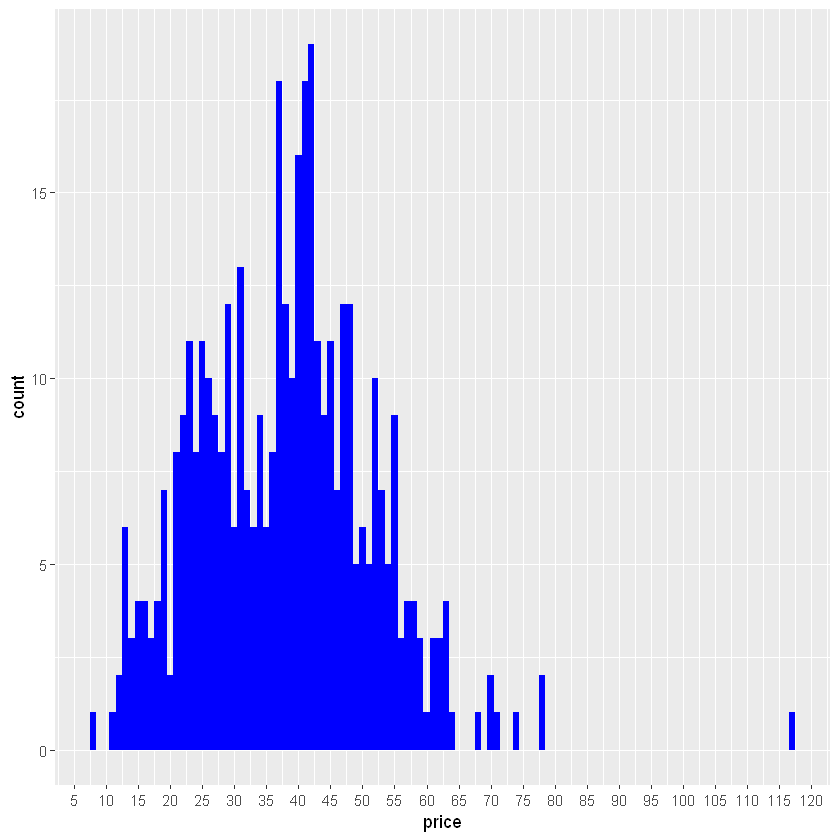


```R
ggplot(data=house[!is.na(house$price),], aes(x=date, y=price))+
  geom_point(col='blue') + geom_smooth(method = "lm", se=FALSE, color="black", aes(group=1)) +
  scale_y_continuous(breaks= seq(0, 1000, by=100), )
```

    `geom_smooth()` using formula 'y ~ x'
    


```R
ggplot(data=house[!is.na(house$price),], aes(x=age, y=price))+
  geom_point(col='blue') + geom_smooth(method = "lm", se=FALSE, color="black", aes(group=1)) +
  scale_y_continuous(breaks= seq(0, 1000, by=100), )
```

    `geom_smooth()` using formula 'y ~ x'
    


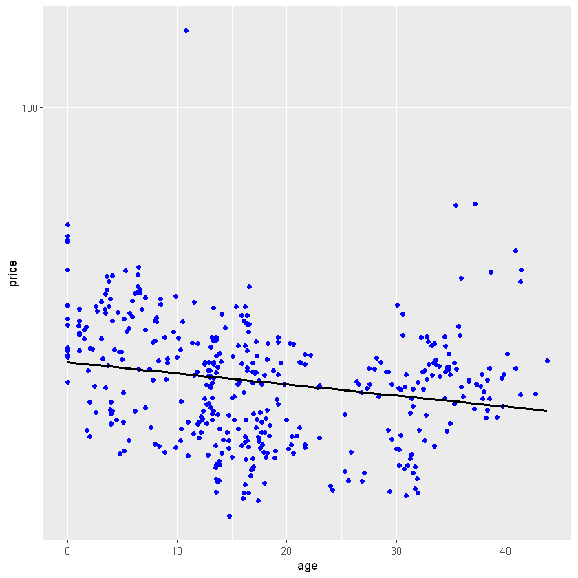


```R
ggplot(data=house[!is.na(house$price),], aes(x=store, y=price))+
  geom_point(col='blue') + geom_smooth(method = "lm", se=FALSE, color="black", aes(group=1)) +
  scale_y_continuous(breaks= seq(0, 1000, by=100), )
```

    `geom_smooth()` using formula 'y ~ x'
    


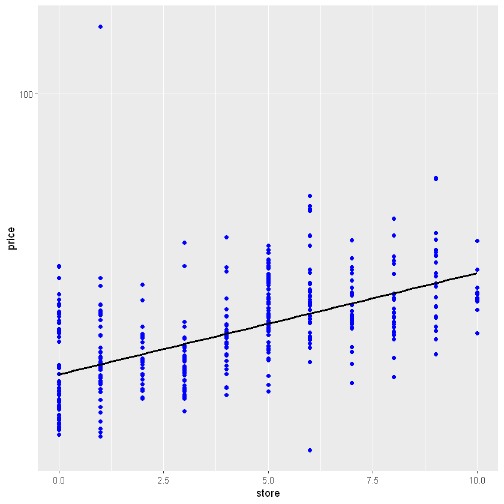


```R
ggplot(data=house[!is.na(house$price),], aes(x=lat, y=price))+
  geom_point(col='blue') + geom_smooth(method = "lm", se=FALSE, color="black", aes(group=1)) +
  scale_y_continuous(breaks= seq(0, 1000, by=100), )
```

    `geom_smooth()` using formula 'y ~ x'
    


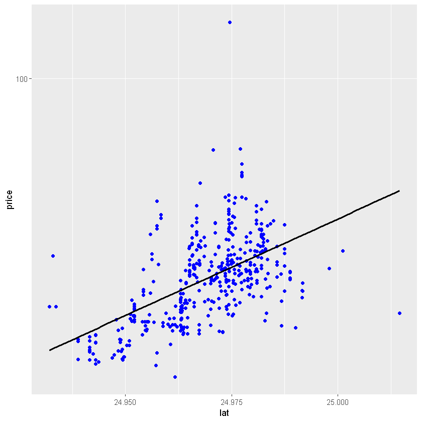


```R
ggplot(data=house[!is.na(house$price),], aes(x=lon, y=price))+
  geom_point(col='blue') + geom_smooth(method = "lm", se=FALSE, color="black", aes(group=1)) +
  scale_y_continuous(breaks= seq(0, 1000, by=100), )
```

    `geom_smooth()` using formula 'y ~ x'
    


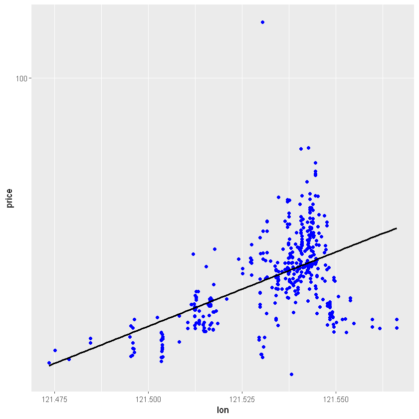


```R
#correlation plot 그려보가
numericVars <- which(sapply(house, is.numeric))
numericVarNames <- names(numericVars)
all_numVar <- house[, numericVars]
cor_numVar <- cor(all_numVar, use="pairwise.complete.obs")
cor_sorted <- as.matrix(sort(cor_numVar[,'price'], decreasing = TRUE))
CorHigh <- names(which(apply(cor_sorted, 1, function(x) abs(x)>0.01)))
cor_numVar <- cor_numVar[CorHigh, CorHigh]
corrplot.mixed(cor_numVar, tl.col="black", tl.pos = "lt")
```


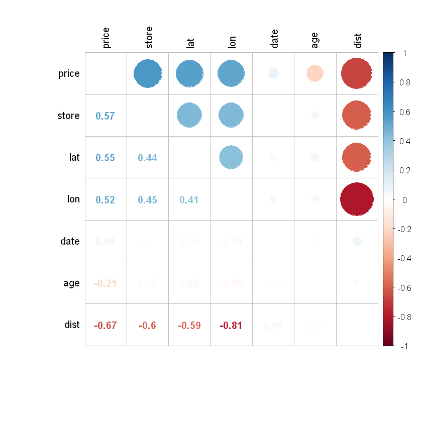


```R

```

# data pre-preprocessing


```R
house$year=floor(house$date)
x=house$date-house$year
house$month=ceiling(ceiling(x*365)/31+1)
```


```R

noprice=model.matrix(price~.,data=house)[,-1]
PreNum <- preProcess(noprice, method=c("center", "scale"))
housenorm=predict(PreNum,noprice)

price=house$price
house2=cbind(housenorm,price)
house2=as.data.frame(house2)
```

# modeling


```R
fit1=lm(price~date+age+dist+store+lat+lon,data=house)

vif(fit1)
#all VIF <5

```


<dl class=dl-horizontal>
	<dt>date</dt>
		<dd>1.0146736235677</dd>
	<dt>age</dt>
		<dd>1.01428676481051</dd>
	<dt>dist</dt>
		<dd>4.32301946903343</dd>
	<dt>store</dt>
		<dd>1.61703774850563</dd>
	<dt>lat</dt>
		<dd>1.61023439334127</dd>
	<dt>lon</dt>
		<dd>2.92630210289017</dd>
</dl>


```R
fit3=lm(price~date+age+dist+store+lat+lon+I(lat^2)+I(lon^2)+I(age^2)+I(lat^3)+I(age^3)+I(lon^4)
        +I(lat^4)+I(dist^2)+I(dist^3)+I(dist^4),data=house2)
AIC(fit3)
#best AIC model, with AIC =2861.68
```


2861.68118342164


```R
summary(fit3)
fit3$coefficients
```


    
    Call:
    lm(formula = price ~ date + age + dist + store + lat + lon + 
        I(lat^2) + I(lon^2) + I(age^2) + I(lat^3) + I(age^3) + I(lon^4) + 
        I(lat^4) + I(dist^2) + I(dist^3) + I(dist^4), data = house2)
    
    Residuals:
        Min      1Q  Median      3Q     Max 
    -31.361  -3.993  -0.401   3.533  69.747 
    
    Coefficients:
                Estimate Std. Error t value Pr(>|t|)    
    (Intercept) 31.69564    1.96112  16.162  < 2e-16 ***
    date         1.85697    0.37520   4.949 1.10e-06 ***
    age         -4.41197    0.92676  -4.761 2.71e-06 ***
    dist        -7.15784    3.11510  -2.298  0.02209 *  
    store        0.86541    0.55071   1.571  0.11688    
    lat          6.03926    0.72318   8.351 1.14e-15 ***
    lon          1.67180    1.06362   1.572  0.11679    
    I(lat^2)    -1.26957    0.86438  -1.469  0.14269    
    I(lon^2)    -1.46964    2.13972  -0.687  0.49259    
    I(age^2)     1.89193    0.44412   4.260 2.56e-05 ***
    I(lat^3)    -0.64745    0.15371  -4.212 3.13e-05 ***
    I(age^3)     0.34420    0.41062   0.838  0.40241    
    I(lon^4)     0.05571    0.16238   0.343  0.73173    
    I(lat^4)     0.10708    0.07687   1.393  0.16441    
    I(dist^2)   10.63161    2.06533   5.148 4.16e-07 ***
    I(dist^3)   -3.59816    1.21938  -2.951  0.00336 ** 
    I(dist^4)    0.37227    0.22555   1.651  0.09963 .  
    ---
    Signif. codes:  0 '***' 0.001 '**' 0.01 '*' 0.05 '.' 0.1 ' ' 1
    
    Residual standard error: 7.498 on 397 degrees of freedom
    Multiple R-squared:  0.7081,	Adjusted R-squared:  0.6963 
    F-statistic: 60.18 on 16 and 397 DF,  p-value: < 2.2e-16
    


<dl class=dl-horizontal>
	<dt>(Intercept)</dt>
		<dd>31.6956420738216</dd>
	<dt>date</dt>
		<dd>1.8569695397647</dd>
	<dt>age</dt>
		<dd>-4.41196651210188</dd>
	<dt>dist</dt>
		<dd>-7.15783626143212</dd>
	<dt>store</dt>
		<dd>0.865410314060324</dd>
	<dt>lat</dt>
		<dd>6.03926352464616</dd>
	<dt>lon</dt>
		<dd>1.67179581827767</dd>
	<dt>I(lat^2)</dt>
		<dd>-1.26956952221397</dd>
	<dt>I(lon^2)</dt>
		<dd>-1.46963763579737</dd>
	<dt>I(age^2)</dt>
		<dd>1.89192996428023</dd>
	<dt>I(lat^3)</dt>
		<dd>-0.647449107598155</dd>
	<dt>I(age^3)</dt>
		<dd>0.344196190008464</dd>
	<dt>I(lon^4)</dt>
		<dd>0.0557058181809603</dd>
	<dt>I(lat^4)</dt>
		<dd>0.107076765982912</dd>
	<dt>I(dist^2)</dt>
		<dd>10.6316145470878</dd>
	<dt>I(dist^3)</dt>
		<dd>-3.59816305245352</dd>
	<dt>I(dist^4)</dt>
		<dd>0.372266813041551</dd>
</dl>


# Q 1 -(2)
- Based on the model obtained from part (1), interpret the relationship between house price
and each input variable as detail as possible.

- 먼저 date와는 양의 선형관계를 보이며, (normarized)date가 1 증가함에 따라 price가 1.85정도 증가한다
- age와는 3차적인 관계를 보이며 dist, lat, lon과는 4차적인 관계를 보였다.
- store또한 양의 미약한 선형관계를 보였으며, (normarized)store변수가 1 증가함에 따라 price가 0.86정도 증가한다.
- date변수를 년도와 달 변수로 나누어서 분석을 진행했지만 유의미한 차이가 없었다.
- 

# 문제 2번-(1)
-  Using the data modelling techniques (parametric modelling), build your best prediction
model from the training data [NOTE: You might need the transformation of variables or
variable selection].


# EDA


```R

test=read.csv('pm25_te-1.csv',header=T)
train=read.csv('pm25_tr-1.csv',header=T)
all<-rbind(train,test)

```


```R
##1-1. target dist => unnormalized skewed plot=>log transformation needed

ggplot(data=all[!is.na(all$pm25),], aes(x=pm25)) +
  geom_histogram(fill="blue", binwidth = 1) +
  scale_x_continuous(breaks= seq(0, 200, by=5))
```


```R
#1-2. summary stat
summary(all$pm25)
```


       Min. 1st Qu.  Median    Mean 3rd Qu.    Max. 
       4.00   32.00   67.00   88.12  123.00  784.00 


```R
#1-3. Correlations with pm25
numericVars <- which(sapply(all, is.numeric))
numericVarNames <- names(numericVars)
all_numVar <- all[, numericVars]
cor_numVar <- cor(all_numVar, use="pairwise.complete.obs")
cor_sorted <- as.matrix(sort(cor_numVar[,'pm25'], decreasing = TRUE))
CorHigh <- names(which(apply(cor_sorted, 1, function(x) abs(x)>0.1)))
cor_numVar <- cor_numVar[CorHigh, CorHigh]

corrplot.mixed(cor_numVar, tl.col="black", tl.pos = "lt")
```


```R
#1-4. 높은 상관관계 갖는거만 plot 그려보기
```


```R
ggplot(data=all[!is.na(all$pm25),], aes(x=DEWP, y=pm25))+
  geom_point(col='blue') + geom_smooth(method = "lm", se=FALSE, color="black", aes(group=1)) +
  scale_y_continuous(breaks= seq(0, 1000, by=100), )


```

    `geom_smooth()` using formula 'y ~ x'
    


```R
ggplot(data=all[!is.na(all$pm25),], aes(x=PRES, y=pm25))+
  geom_point(col='blue') + geom_smooth(method = "lm", se=FALSE, color="black", aes(group=1)) +
  scale_y_continuous(breaks= seq(0, 1000, by=100), )
```

    `geom_smooth()` using formula 'y ~ x'
    


```R
#???? 이상한 형태
#역수 취해서(1/x) linear relationship 나타내게 해줄 수 있겠다.

ggplot(data=all[!is.na(all$pm25),], aes(x=Iws, y=pm25))+
  geom_point(col='blue') + geom_smooth(method = "lm", se=FALSE, color="black", aes(group=1)) +
  scale_y_continuous(breaks= seq(0, 1000, by=100), )

```

    `geom_smooth()` using formula 'y ~ x'
    


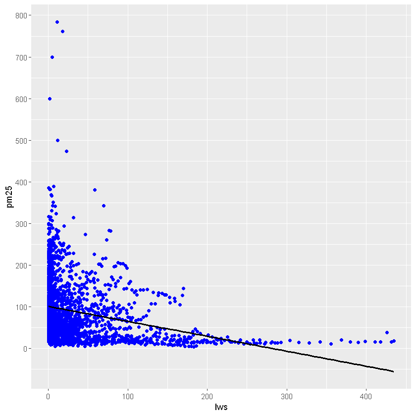


```R
#after transformation
all$Iws=1/(all$Iws)^2 #better performance if squring
ggplot(data=all[!is.na(all$pm25),], aes(x=Iws, y=pm25))+
  geom_point(col='blue') + geom_smooth(method = "lm", se=FALSE, color="black", aes(group=1)) +
  scale_y_continuous(breaks= seq(0, 1000, by=100), )

```

    `geom_smooth()` using formula 'y ~ x'
    


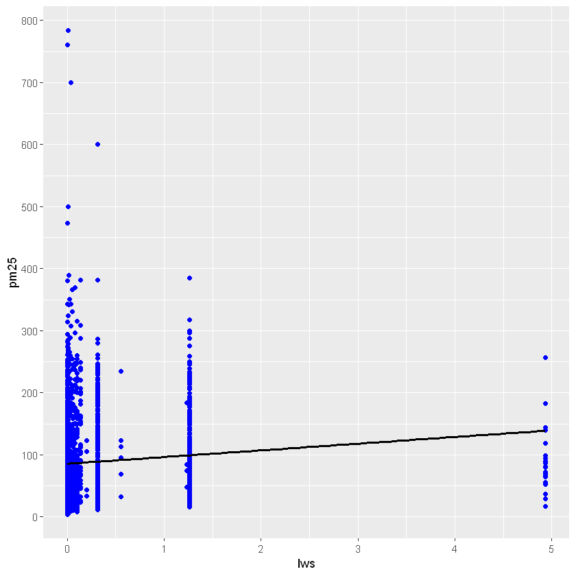


```R
ggplot(data=all[!is.na(all$pm25),], aes(x=hour, y=pm25))+
  geom_point(col='blue') + geom_smooth(method = "lm", se=FALSE, color="black", aes(group=1)) +
  scale_y_continuous(breaks= seq(0, 1000, by=100), )

```

    `geom_smooth()` using formula 'y ~ x'
    


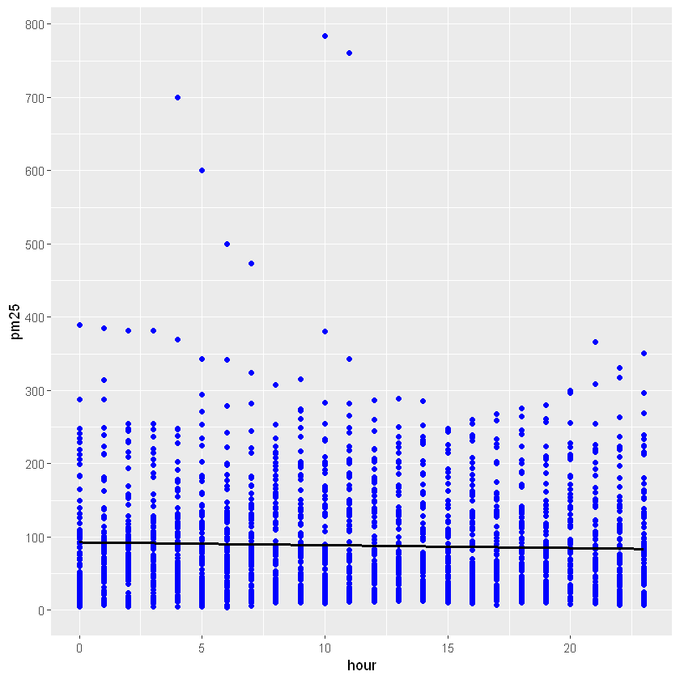


```R
ggplot(data=all[!is.na(all$pm25),], aes(x=TEMP, y=pm25))+
  geom_point(col='blue') + geom_smooth(method = "lm", se=FALSE, color="black", aes(group=1)) +
  scale_y_continuous(breaks= seq(0, 1000, by=100), )
#특정 온도구간에서 증가하는 모습. =>특정 구간 속하는지 여부로 categorical 만들어 줄 수도 있겠음.(discretization)
#아니면 quadratic term 추가하기
#또는 꼬리가 두꺼운 코시 커널을 적용할 수도 있음
```

    `geom_smooth()` using formula 'y ~ x'
    


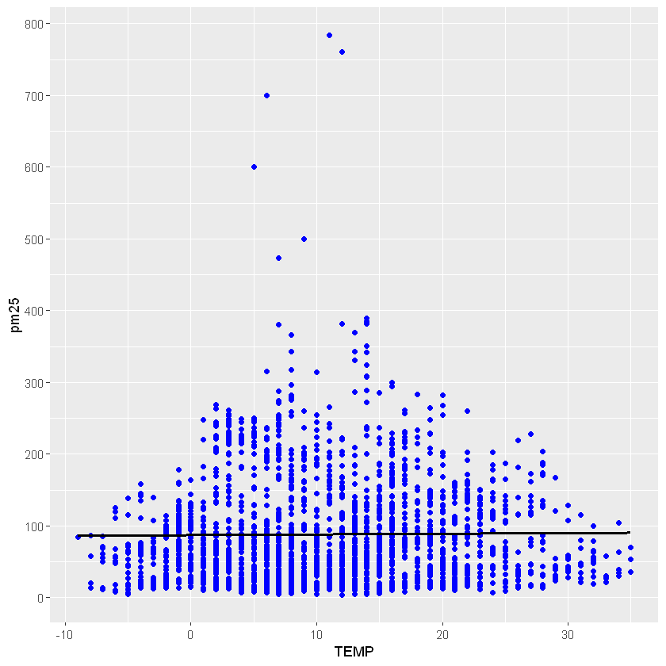


```R
# correlation plot again
numericVars <- which(sapply(all, is.numeric))
actorVars <- which(sapply(all, is.factor))
all_numVar <- all[, numericVars]
cor_numVar <- cor(all_numVar, use="pairwise.complete.obs")
cor_sorted <- as.matrix(sort(cor_numVar[,'pm25'], decreasing = TRUE))
cor_numVar <- cor_numVar[CorHigh, CorHigh]
CorHigh <- names(which(apply(cor_sorted, 1, function(x) abs(x)>0.1)))

corrplot.mixed(cor_numVar, tl.col="black", tl.pos = "lt", tl.cex = 0.7,cl.cex = .7, number.cex=.7)
                             
#high corr between PRES & month
                    
                            
```


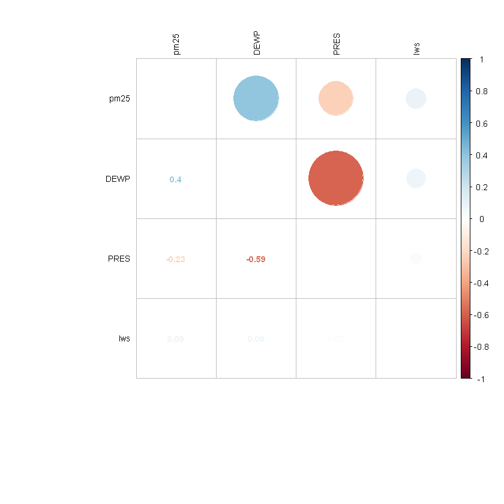


```R
#feature impotance using RF

set.seed(2020)
quick_RF <- randomForest(x=select(all,month,day,hour,DEWP,TEMP,PRES,cbwd,Iws)[1:1944,], y=all$pm25[1:1944], ntree=100,importance=TRUE)
imp_RF <- importance(quick_RF)
imp_DF <- data.frame(Variables = row.names(imp_RF), MSE = imp_RF[,1])
imp_DF <- imp_DF[order(imp_DF$MSE, decreasing = TRUE),]
ggplot(imp_DF[1:8,], aes(x=reorder(Variables, MSE), y=MSE, fill=MSE)) + geom_bar(stat = 'identity') + labs(x = 'Variables', y= '% increase MSE if variable is randomly permuted') + coord_flip() + theme(legend.position="none")

```


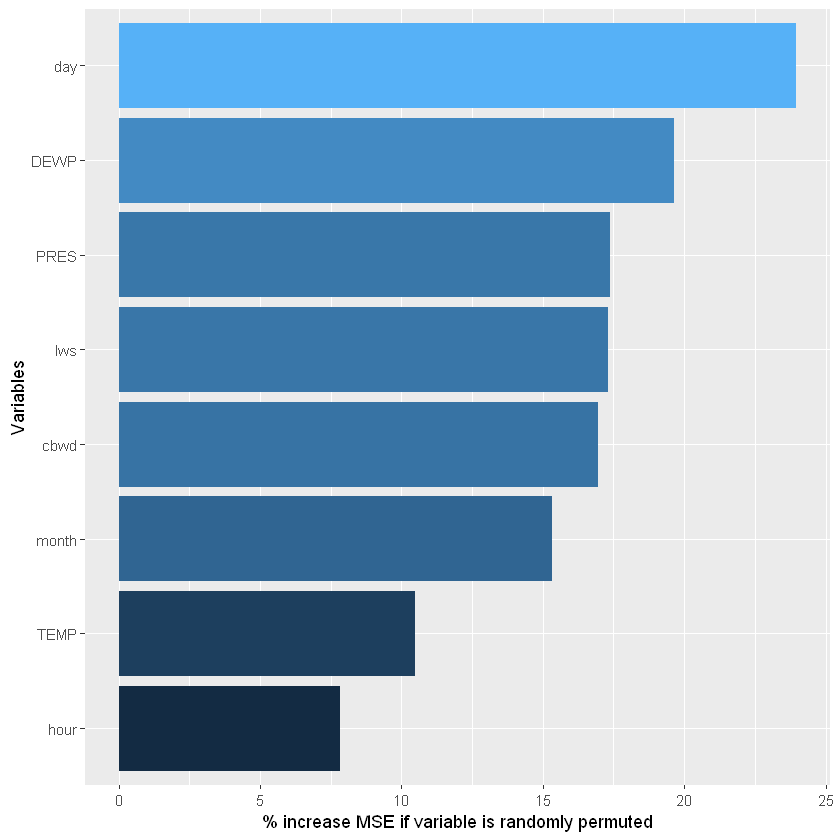


# Data pre-processing


```R
#2-1. label encoding
all$cbwd=as.factor(all$cbwd)
#2-2 day->factor
all$day=as.factor(all$day)
```


```R
#상관관계가 높은 변수들 중 pm25와 상관관계가 적은 것 우선으로 제거 
#TEMP와 month, PRES가 높은데 (각각 0.7이상)
#month변수 제거
dropvar=c('month')
all <- all[,!(names(all) %in% dropvar)]

```


```R
#skewness


skewness(all$pm25)
```


2.1826645067395


```R
qqnorm(all$pm25)
qqline(all$pm25)
```


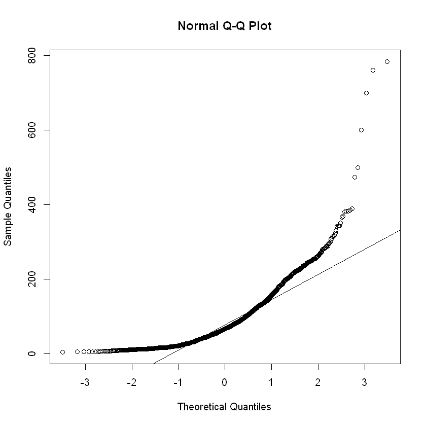


```R
all$pm25 <- log(1+all$pm25)#log0이 나오는 상황 막기위해 1을 더했습니다
```


```R
skewness(all$pm25)
qqnorm(all$pm25)
qqline(all$pm25)
```


-0.223399547843811


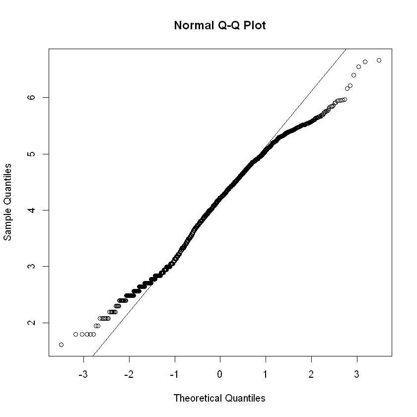


```R
numericVarNames <- numericVarNames[!(numericVarNames %in% c('pm25','day','Iws'))]
DFnumeric <- all[, names(all) %in% numericVarNames]

DFfactors <- all[, !(names(all) %in% numericVarNames)]
```


```R
#normalizing inputs

DFnumeric <- all[, names(all) %in% numericVarNames]
DFfactors <- all[, !(names(all) %in% numericVarNames)]
DFfactors <- DFfactors[, names(DFfactors) != 'pm25']
PreNum <- preProcess(DFnumeric, method=c("center", "scale"))
DFnorm <- predict(PreNum, DFnumeric)
```


```R
#one hot encoding for categorical variable( day, cbwd)#앞서 day를 그냥 factor처리 해줬음
DFdummies <- as.data.frame(model.matrix(~.-1, DFfactors))
dim(DFdummies)
```


<ol class=list-inline>
	<li>2064</li>
	<li>35</li>
</ol>


```R
combined <- cbind(DFnorm, DFdummies)
```


```R
dim(combined[1945:2064,])
```


<ol class=list-inline>
	<li>120</li>
	<li>39</li>
</ol>


```R
train1=combined[1:1944,]
test1=combined[1945:2064,]
```

# modeling - Lasso regression


```R
set.seed(20220)
my_control <-trainControl(method="cv", number=5)
lassoGrid <- expand.grid(alpha = 1, lambda = seq(0.001,0.1,by = 0.0005))

lasso_mod <- train(x=train1, y=all$pm25[1:1944], method='glmnet', trControl= my_control, tuneGrid=lassoGrid) 
lasso_mod$bestTune
```


<table>
<thead><tr><th scope=col>alpha</th><th scope=col>lambda</th></tr></thead>
<tbody>
	<tr><td>1    </td><td>0.001</td></tr>
</tbody>
</table>


# 문제 2번 -(2)
- MSE 계산
-  Compute the test MSE of your model obtained in part (1) using the test set.


```R
LassoPred <- predict(lasso_mod, test1)
predictions_lasso <- exp(LassoPred)-1#원래 값으로 돌리기
mean((predictions_lasso-test$pm25)^2)
```


2483.65011803359


```R

```


```R

```
